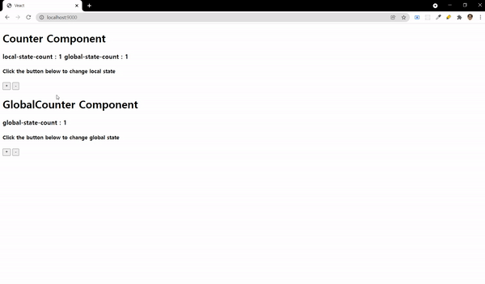

# Veact

> Vanilla JS + React = Veact

## Goal

최근 프로젝트에서 React를 통해 SPA를 경험했다.  
React, react-router를 이용하면서 상태관리, 라우팅을 쉽게 구현했지만 내부 동작은 알기 어려웠다.

그래서, Vanilla JS로 SPA를 구현해보고자 한다. 어려울 것 같다.. 일단 시작해보자!

**🔥🔥🔥🔥🔥🔥 Learning by doing🔥🔥🔥🔥🔥🔥**

## 상태 관리

우선 상태란 UI(View)에서 동작하는 방식을 결정하는 요소이다. 예를 들어, 체크박스가 선택 여부를 하나의 상태로 관리할 수 있다.

상태 관리를 위해서는 **3가지의 기능**이 필요하다.

1. Create: 최초에 상태를 지정할 수 있다.
2. Read: 현재 상태를 읽을 수 있다.
3. Update: 상태를 변경할 수 있다.

## Scripts

```bash
# 1. build
npm run build

# 2. run
npm run dev

# 3. visit site
http://localhost:9000/
```

## Demo

### Global State Management



## Check List

-   Component

    -   [x] mount 전, 후를 확인하는 생명 주기 메소드를 제공한다.
    -   [x] 상태가 변경될 때 마다 렌더링이 다시 발생한다.
    -   [x] props를 통해 자식 컴포턴트에 상태를 전달 할 수 있다.

-   지역 상태 관리

    -   [x] 상태가 지역적으로 동작한다. (다른 지역상태에 영향 X)

-   전역 상태 관리
    -   [x] flux 패턴을 이용하였다. (action,dispatch)
    -   [x] 싱글톤으로 전역 store가 관리된다.
-   Build
    -   [x] Webpack을 통해 빌드하였다.
    -   [x] Babel을 통해 ES6+ 이후 문법을 트랜스파일링 된다.
    -   [x] core-js를 통해 promise, async, await 같은 문법을 폴리필 하였다.
-   SPA router
    -   [x] 라우팅 과정에서 새로고침이 발생하지 않는다.
    -   [x] 새로고침을 해도 현재 페이지가 유지된다.
    -   [x] 동적 라우팅을 적용한다.
    -   [ ] 라우팅 과정에서 스크롤 위치가 복원된다.
-   httpRequest(optional)
    -   [x] fetch 함수를 추상화하여 사용한다.
    -   [x] async/await (then을 사용하지 않는다.)
    -   [ ] 응답의 요청/실패에 대한 UI처리를 수행한다. => `Toast` 만들어보기
    -   [ ] 라우팅 과정에서 api 재호출을 방지해본다.
-   infinite scroll(optional)
    -   [ ] Intersection Observer을 적용했다.
    -   [ ]
-   util(optional)
    -   [ ] debounce, throttling
    -   [ ] functional programming(go, pipe, curry, filter, each)

### notes

-   [History API](./docs/historyAPI.md)

### Ref.

-   [FxDOM](https://github.com/marpple/FxDOM)
